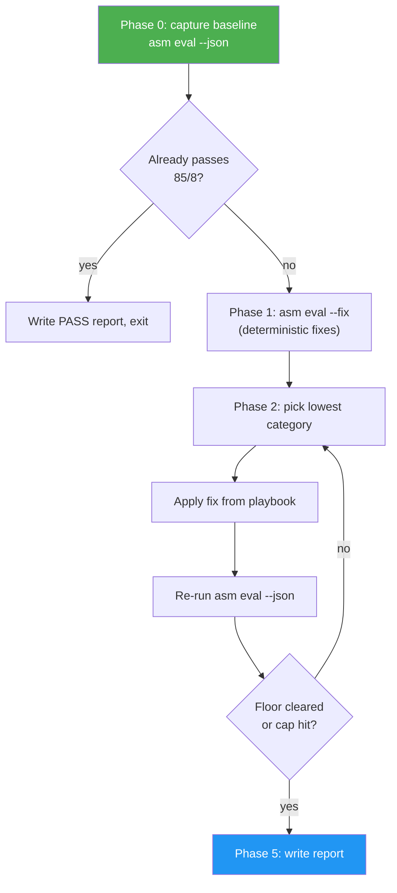

# Skill Auto-Improver

> Eval-driven improvement loop for SKILL.md-based skills. Iterates `asm eval` until a skill clears a strict quality floor — **overallScore > 85** and **every category >= 8** — or stops with a blocker report.

## Highlights

- Opinionated around `asm eval` results and the 85/8 rule
- Deterministic fixes first (`asm eval --fix`), content fixes second
- One category at a time, re-eval after every edit
- Hard loop cap (8 iterations) so it never runs unbounded
- Saves every iteration JSON to `.asm-improver/` for auditability
- Writes a final before/after report on pass or blocker

## When to Use

| Say this...                          | Skill will...                                     |
| ------------------------------------ | ------------------------------------------------- |
| "Improve skills/my-skill"            | Baseline, fix, loop, report                       |
| "Level up this skill before publish" | Same, with publish-readiness as the goal          |
| "My skill scored 62 — fix it"        | Baseline, fix, loop until 85/8 or blocker         |
| "Run asm eval on skills/my-skill"    | **Not this skill** — just run `asm eval` directly |

## Usage

```
/skill-auto-improver skills/my-skill
```

Or paste a skill path and the skill triggers automatically. GitHub shorthand inputs are accepted but v0.1 asks you to clone locally first — remote editing is out of scope.

## Pipeline



## The 85/8 Rule

```
overallScore > 85   AND   min(categories[*].score) >= 8
```

Strictly harder than "overallScore > 85" alone. A skill at 86 with a 5 in `testability` still fails — a single weak category blocks the skill. This forces balanced quality instead of letting one strong area hide a weak one.

## Output

- `.asm-improver/baseline.json` — eval result before any edits
- `.asm-improver/iter-N.json` — eval result after every iteration
- `.asm-improver/report.md` — before/after summary with per-category diff, files changed, and pass/blocker verdict
- `SKILL.md.bak` — backup written by `asm eval --fix` (left in place until you clean up)

## Stop Conditions

The loop stops on any of:

| Condition                              | Outcome          |
| -------------------------------------- | ---------------- |
| overallScore > 85 AND min(scores) >= 8 | PASS             |
| 8 iterations completed                 | BLOCKER          |
| 3 iterations with no score change      | BLOCKER          |
| 2 iterations with score regression     | BLOCKER (revert) |

## See Also

- [SKILL.md](./SKILL.md) — the agent workflow
- [references/category-playbook.md](./references/category-playbook.md) — per-category fix patterns
- `asm eval --help` — evaluator flag reference
