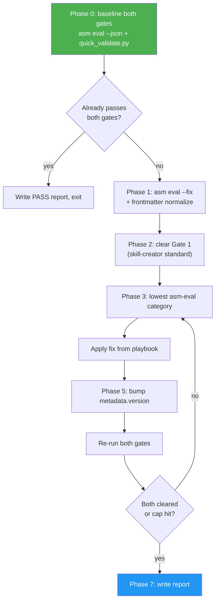

<!--
  DO NOT READ THIS FILE — This README.md is for human catalog browsing only.
  It ships inside the .skill package but is NEVER auto-loaded into agent context.
  The runtime loader only reads SKILL.md + references/ + scripts/ + agents/ when the skill triggers.
  If you're an AI agent, read the SKILL.md file instead for skill instructions.
-->

# Skill Auto-Improver

> Two-gate improvement loop for SKILL.md-based skills. Iterates until the target skill clears the **skill-creator standard** (mechanical validator + frontmatter audit + ≤500-line body + AI-skip README) **AND** the **asm-eval 85/8 floor** (overallScore > 85, every category ≥ 8) — or stops with a blocker report.

## Highlights

- **Two gates, both must pass.** Gate 1 = skill-creator standard (publish-blocking). Gate 2 = asm-eval 85/8 quality floor.
- Deterministic fixes first (`asm eval --fix`), then frontmatter normalization to satisfy `quick_validate.py`, then content fixes by lowest category.
- One category at a time, re-eval against **both** gates after every edit.
- Hard loop cap (8 iterations) so it never runs unbounded.
- Bumps the target skill's `metadata.version` once per iteration per skill-creator's Version Management rule.
- Saves every iteration JSON and gate-summary line to `.asm-improver/` for auditability.
- Writes a final before/after report on pass or blocker.

## When to Use

| Say this...                             | Skill will...                                            |
| --------------------------------------- | -------------------------------------------------------- |
| "Improve skills/my-skill"               | Baseline both gates, fix, loop, report                   |
| "Bring this skill up to standard"       | Same — Gate 1 retrofit takes priority over Gate 2 polish |
| "Level up this skill before publish"    | Same, with `asm publish` readiness as the goal           |
| "My skill scored 62 — fix it"           | Baseline, fix, loop until both gates clear or blocker    |
| "Run asm eval on skills/my-skill"       | **Not this skill** — just run `asm eval` directly        |
| "Author a brand-new skill from scratch" | **Not this skill** — use `/skill-creator` instead        |

## Usage

```
/skill-auto-improver skills/my-skill
```

Or paste a skill path and the skill triggers automatically. GitHub shorthand inputs are accepted but v1 asks you to clone locally first — remote editing is out of scope.

## How It Works



## The Two Gates

### Gate 1 — skill-creator standard (must-pass)

- `quick_validate.py` exits 0 with no warnings
- Frontmatter audit clean (allowed top-level keys only, `metadata.version` + `metadata.author` present, YAML safety, name matches directory)
- Description ≤250 chars (target) with a negative-trigger clause
- SKILL.md body under 500 lines
- `docs/README.md` (if present) carries the AI-skip notice
- Bundled scripts print descriptive errors before exiting

### Gate 2 — asm-eval 85/8 quality floor

```
overallScore > 85   AND   min(categories[*].score) >= 8
```

Stricter than overall score alone — a skill at 86 with a 5 in `testability` still fails. Forces balanced quality across all 7 categories instead of letting one strong area hide a weak one.

## Output

| Path                                          | Description                                                                                    |
| --------------------------------------------- | ---------------------------------------------------------------------------------------------- |
| `.asm-improver/baseline.json`                 | asm-eval result before any edits                                                               |
| `.asm-improver/baseline-quickvalidate.txt`    | quick_validate.py output before any edits                                                      |
| `.asm-improver/baseline-frontmatter-audit.md` | Frontmatter audit findings before any edits                                                    |
| `.asm-improver/iter-N.json`                   | asm-eval result after iteration N                                                              |
| `.asm-improver/iter-N-gates.txt`              | One-line summary of both gates after iteration N                                               |
| `.asm-improver/report.md`                     | Before/after summary with per-gate diff, files changed, version bump, and pass/blocker verdict |
| `SKILL.md.bak`                                | Backup written by `asm eval --fix` (left in place until you clean up)                          |

## Stop Conditions

The loop stops on any of:

| Condition                                             | Outcome          |
| ----------------------------------------------------- | ---------------- |
| Gate 1 passes AND Gate 2 (overallScore > 85, min ≥ 8) | PASS             |
| 8 iterations completed                                | BLOCKER          |
| 3 iterations with no movement on either gate          | BLOCKER          |
| 2 iterations with regression on either gate           | BLOCKER (revert) |

## Resources

| Path                                                                              | Description                                                          |
| --------------------------------------------------------------------------------- | -------------------------------------------------------------------- |
| [SKILL.md](../SKILL.md)                                                           | The agent workflow                                                   |
| [references/skill-creator-checklist.md](../references/skill-creator-checklist.md) | Gate 1 retrofit playbook (frontmatter, README, scripts, body length) |
| [references/frontmatter-audit.md](../references/frontmatter-audit.md)             | Full audit checklist + `asm eval --fix` normalization migration      |
| [references/category-playbook.md](../references/category-playbook.md)             | Per-category fix patterns for Gate 2                                 |
| [references/report-template.md](../references/report-template.md)                 | PASS and BLOCKER report layouts                                      |
| `asm eval --help`                                                                 | Evaluator flag reference                                             |
| `~/.claude/skills/skill-creator/`                                                 | Upstream source of the Gate 1 standard                               |
