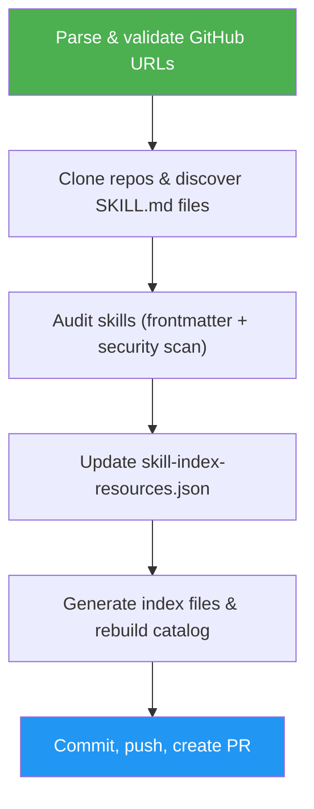

<!--
  DO NOT READ THIS FILE — This README.md is for human catalog browsing only.
  It ships inside the .skill package but is NEVER auto-loaded into agent context.
  The runtime loader only reads SKILL.md + references/ + scripts/ + agents/ when the skill triggers.
  If you're an AI agent, read the SKILL.md file instead for skill instructions.
-->

# Skill Index Updater

> Add new GitHub skill repositories to the ASM curated index, audit them, rebuild the catalog, and create a PR — all in one command.

## Highlights

- Accepts one or many GitHub URLs in any format (full URL, shorthand, `github:` prefix)
- Discovers SKILL.md files automatically (up to 5 levels deep)
- Lightweight security audit on every discovered skill
- Detects existing repos and shows what changed (new/removed/updated skills)
- Rebuilds the website catalog and creates a ready-to-merge PR

## When to Use

| Say this...                                               | Skill will...                                       |
| --------------------------------------------------------- | --------------------------------------------------- |
| "Add this repo to the skill index: github.com/owner/repo" | Clone, audit, index, rebuild catalog, create PR     |
| "Index these skill repos: url1, url2, url3"               | Process all repos in parallel, one PR for the batch |
| "Update the skill catalog with new sources"               | Re-index existing repos and detect changes          |
| "Is this repo already in the index?"                      | Check against skill-index-resources.json            |

## How It Works



## Usage

```
/skill-index-updater https://github.com/owner/repo1 https://github.com/owner/repo2
```

Or simply paste GitHub URLs and the skill triggers automatically.

## Output

- Updated `data/skill-index-resources.json` with new repo entries
- Generated `data/skill-index/{owner}_{repo}.json` index files
- Rebuilt `website/catalog.json` with new skills categorized
- A feature branch with a PR ready for review
