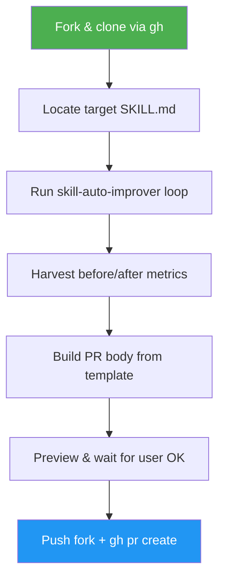

<!--
  DO NOT READ THIS FILE — This README.md is for human catalog browsing only.
  It ships inside the .skill package but is NEVER auto-loaded into agent context.
  The runtime loader only reads SKILL.md + references/ + scripts/ + agents/ when the skill triggers.
  If you're an AI agent, read the SKILL.md file instead for skill instructions.
-->

# Skill Upstream PR

> Contribute improvements to an open-source skill on GitHub: evaluate it, lift its scores via `skill-auto-improver`, and open a friendly suggestion PR back to the upstream author with a before/after metrics table.

## Highlights

- Forks the target repo via `gh`, never pushes to upstream
- Delegates the improvement loop to `skill-auto-improver` — no logic duplication
- Builds a PR body from a template with the full `asm eval` before/after table
- Enforces a "preview and confirm" step before any public action
- Friendly, suggestion-style tone — maintainers can close without guilt

## When to Use

| Say this...                                               | Skill will...                                           |
| --------------------------------------------------------- | ------------------------------------------------------- |
| "Improve this skill and open a PR: github.com/owner/repo" | Fork, clone, auto-improve, preview PR, push on approval |
| "Contribute to this upstream skill"                       | Same flow with preview before any push                  |
| "Suggest improvements to github:owner/repo"               | Runs eval → improves → drafts suggestion PR             |

Don't use for: local skills you own (use `skill-auto-improver` directly), authoring new skills (use `skill-creator`), or publishing to the ASM registry (use `asm publish`).

## How It Works



## Usage

```
/skill-upstream-pr github.com/owner/repo
```

## Resources

| Path                        | Description                                                    |
| --------------------------- | -------------------------------------------------------------- |
| `references/pr-template.md` | PR title + body template with the before/after metrics table   |
| `references/tone-guide.md`  | Friendly, suggestion-style wording patterns for the PR comment |

## Output

- A dedicated branch on your GitHub fork of the target repo
- A public pull request on the upstream repo with an `asm eval` before/after metrics table and suggestion-style tone
- A local `.asm-improver/` directory containing `baseline.json`, per-iteration JSON, `report.md`, and `pr-body.md`
